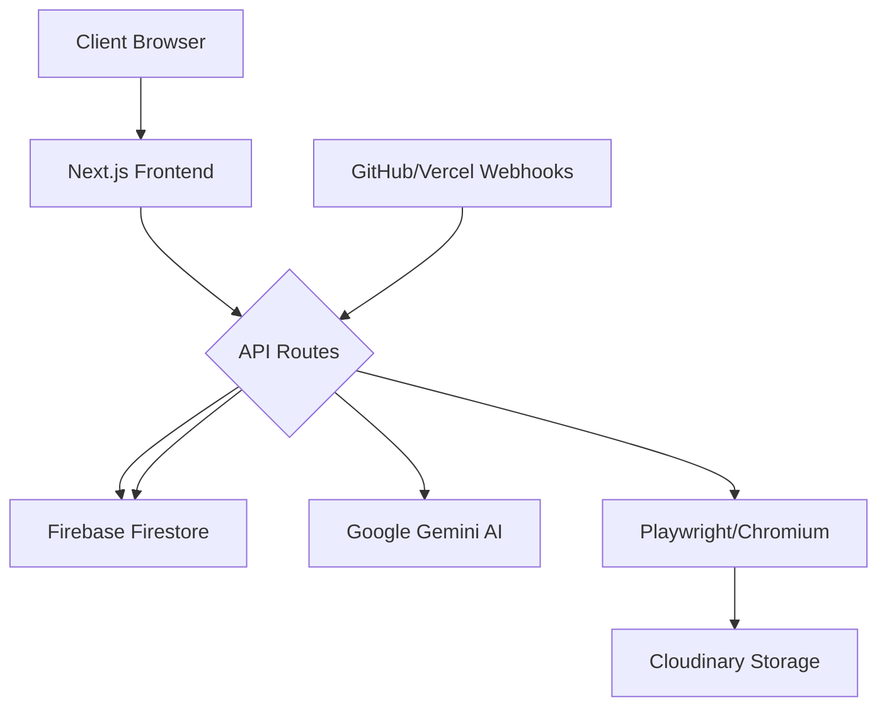

<div align="center">

# 🌌 Modern Interactive Portfolio
**A High-Performance, AI-Enhanced Professional Showcase**

[](https://nextjs.org/)
[](https://www.typescriptlang.org/)
[](https://tailwindcss.com/)
[](https://www.framer.com/motion/)
[](https://firebase.google.com/)
[](https://greensock.com/)

<p align="center">
  <strong>An elite personal portfolio featuring immersive 3D visualizations, AI-driven content generation, and a comprehensive administrative dashboard for real-time project management.</strong>
</p>

---

</div>

## 📖 Overview

This repository is a production-grade personal portfolio engineered for maximum visual impact and performance. Unlike static portfolios, this project implements a **dynamic CMS-like architecture** using Firebase, allowing for real-time updates via a secure admin panel. It blends high-end motion design (GSAP, Lenis) with cutting-edge AI integration to automate project showcasing and screenshot generation.

## 🚀 Key Features

| Feature | Description | Tech Used |
| :--- | :--- | :--- |
| **Immersive Visuals** | 3D Globe skills canvas, particle systems, and custom cursor interactions. | `Three.js` / `Canvas` |
| **Smooth Experience** | High-fidelity smooth scrolling and velocity-based animations. | `Lenis` / `GSAP` |
| **AI Automation** | Automated project description generation and screenshot capturing. | `Gemini AI` / `Playwright` |
| **Admin Dashboard** | Secure panel to manage projects, track analytics, and sync deployments. | `Next.js App Router` |
| **Real-time Sync** | GitHub and Vercel webhook integration for automatic project updates. | `Webhooks` / `Firebase` |
| **Responsive Design** | Fully fluid layout with mobile-first optimization and custom transitions. | `Tailwind CSS` |

## 🛠 Tech Stack

### Core Architecture
- **Framework**: Next.js 15 (App Router)
- **Language**: TypeScript
- **Styling**: Tailwind CSS
- **Database & Auth**: Firebase / Firestore

### Animation & UX
- **Smooth Scroll**: Lenis
- **Motion Engine**: GSAP & Framer Motion
- **Visuals**: Custom Canvas implementations (Perlin Noise, TopoJSON)

### AI & Backend Utilities
- **LLM**: Google Generative AI (Gemini)
- **Automation**: Playwright (Headless Browser for screenshots)
- **Storage**: Cloudinary (Image Optimization)

## 📂 Architecture



### Project Structure
<details>
<summary>View Detailed Folder Hierarchy</summary>

```text
├── app/
│   ├── admin/              # Protected Admin Dashboard
│   │   ├── analytics/      # Traffic & View Tracking
│   │   ├── projects/       # Project CRUD Management
│   │   └── settings/       # Site Configurations
│   ├── api/                # Backend Serverless Functions
│   │   ├── projects/       # Project API & AI Generation
│   │   ├── sync/           # GitHub/Vercel Sync Logic
│   │   └── webhooks/       # External Event Listeners
│   └── layout.tsx          # Root Layout & Providers
├── components/             # Atomic Design Components
│   ├── sections/           # Page Sections (Hero, About, etc.)
│   ├── GlobeSkillsCanvas.tsx # 3D Interactive Globe
│   └── ParticleCanvas.tsx   # Background Visuals
├── data/                   # Static Fallback Data
├── hooks/                  # Custom React Hooks (useLenis, useMousePosition)
├── lib/                    # Shared Utilities (AI, Firebase, GlobeUtils)
└── public/                 # Static Assets
```
</details>

## ⚙️ Getting Started

### Prerequisites
- Node.js 18+
- Firebase Account
- Cloudinary Account
- Google AI Studio API Key

### Installation

1. **Clone the repository**
   ```bash
   git clone https://github.com/ajay1234-dev/myportfolio89.git
   cd myportfolio89
   ```

2. **Install dependencies**
   ```bash
   npm install
   ```

3. **Environment Setup**
   Create a `.env.local` file in the root directory:
   ```env
   # Firebase
   NEXT_PUBLIC_FIREBASE_API_KEY=your_key
   FIREBASE_ADMIN_SDK_JSON=your_service_account_json

   # AI & Media
   GOOGLE_GEMINI_API_KEY=your_gemini_key
   CLOUDINARY_URL=your_cloudinary_url

   # Deployment
   VERCEL_WEBHOOK_SECRET=your_secret
   ```

4. **Run Development Server**
   ```bash
   npm run dev
   ```

## 🤖 AI & Automation Pipeline

The project utilizes a sophisticated pipeline to reduce manual entry:
1. **Trigger**: A GitHub push or Vercel deployment triggers a webhook.
2. **Analysis**: The `api/projects/generate` route uses **Gemini AI** to analyze the project.
3. **Capture**: **Playwright** launches a headless Chromium instance to take a high-res screenshot of the live site.
4. **Storage**: The image is uploaded to **Cloudinary**, and the metadata is saved to **Firestore**.
5. **Update**: The portfolio frontend updates instantly via Firebase listeners.

## 🚀 Deployment

The project is optimized for **Vercel**. 

1. Push your code to GitHub.
2. Connect the repo to Vercel.
3. Add the environment variables listed in the "Getting Started" section.
4. Deploy.

## 🤝 Contributing

Contributions are welcome! Please follow these steps:
1. Fork the Project.
2. Create your Feature Branch (`git checkout -b feature/AmazingFeature`).
3. Commit your Changes (`git commit -m 'Add some AmazingFeature'`).
4. Push to the Branch (`git push origin feature/AmazingFeature`).
5. Open a Pull Request.

## 📜 License

This project is proprietary. All rights reserved.

---
<div align="center">
  Made with ❤️ by <a href="https://github.com/ajay1234-dev">Ajay Singh</a>
</div>
